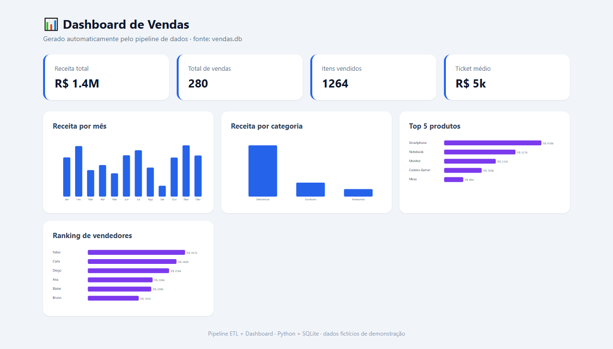

# 📊 Pipeline de ETL + Dashboard de Vendas


[](https://github.com/IasminRDS/Pipeline-de-ETL-Dashboard-de-Vendas/actions/workflows/ci.yml)

Pipeline de dados de ponta a ponta: **extrai** um CSV bruto de vendas, **trata e enriquece** os dados, **carrega** em um banco SQLite e gera um **dashboard de BI** — tudo em Python.

Projeto inspirado na minha experiência com **rotinas ETL, análise de dados e dashboards de performance**.



## 🔄 O fluxo (ETL)

```
dados/vendas.csv  ──►  etl.py  ──►  vendas.db  ──►  analise.py   (KPIs no terminal)
   (dados brutos)     (E-T-L)      (SQLite)     └►  dashboard.py (dashboard.html)
```

1. **Extract** — lê o CSV bruto (com dados "sujos" de propósito)
2. **Transform** — limpa (espaços, capitalização, campos vazios), converte tipos e cria colunas derivadas (receita, mês)
3. **Load** — grava em um banco SQLite pronto para consultas

## ✨ Destaques

- 🧹 **Limpeza de dados** real: padroniza texto, preenche faltantes, remove registros inválidos
- 🗄️ **Análise com SQL**: KPIs, receita por categoria/mês, top produtos, ranking de vendedores
- 📈 **Dashboard de BI** em HTML com gráficos SVG (autossuficiente, abre em qualquer navegador)
- 🐳 **Docker**: roda o pipeline inteiro com um comando, sem instalar nada
- 🧪 **9 testes** cobrindo transformação e consultas analíticas

## 🚀 Como executar

```bash
# 1. Instalar dependências
pip install -r requirements.txt

# 2. (Opcional) gerar novamente o dataset de exemplo
python gerar_dados.py

# 3. Rodar o pipeline
python etl.py         # cria vendas.db
python analise.py     # imprime o relatório de KPIs
python dashboard.py   # gera dashboard.html
```

Depois é só abrir o `dashboard.html` no navegador.

### Com Docker (roda tudo de uma vez)

```bash
docker build -t pipeline-vendas .
docker run --rm pipeline-vendas
```

## 🧪 Testes

```bash
python -m unittest -v
```

## 📁 Estrutura

```
pipeline-etl-vendas/
├── dados/
│   └── vendas.csv        # dataset de exemplo (sintético)
├── gerar_dados.py        # gera o CSV de exemplo
├── etl.py                # Extract, Transform, Load
├── analise.py            # consultas SQL analíticas (KPIs)
├── dashboard.py          # gera o dashboard HTML com gráficos SVG
├── test_pipeline.py      # testes automatizados
├── requirements.txt
└── Dockerfile
```

## 🛠️ Tecnologias

- **Python** (pandas para ETL)
- **SQL** / **SQLite** para análise
- **SVG** para visualização de dados
- **Docker** para empacotamento

## 💡 Conceitos demonstrados

- Arquitetura ETL (Extract, Transform, Load) e qualidade de dados
- Análise de dados com SQL (agregações, `GROUP BY`, rankings)
- Geração de dashboards / visualização de dados (BI)
- Testes automatizados e containerização com Docker

> 📌 Os dados são **fictícios**, gerados por `gerar_dados.py` apenas para demonstração.

## 📄 Licença

MIT — veja [LICENSE](./LICENSE).

---

Feito por **Iasmin Ribeiro de Souza** · [LinkedIn](https://www.linkedin.com/in/iasmin-ribeiro-de-souza-033536401) · [GitHub](https://github.com/IasminRDS)
